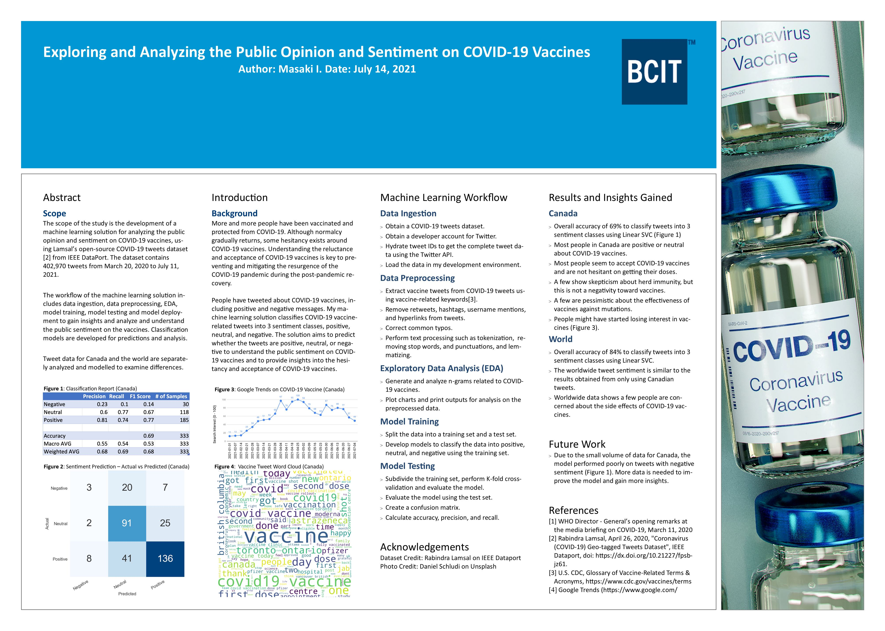

#### Summary

- I developed classification models that classify COVID-19 vaccine-related tweets into three sentiment classes, positive, neutral, and negative, using scikit-learn. The models classified the sentiments of the tweets with 69% accuracy for Canada and 84% accuracy for the world.
- I applied NLP techniques such as lemmatization to extract vaccine-related tweets using NLTK.
- I extracted and analyzed n-grams related to vaccines from vaccine-related tweets.
- Canada and worldwide data show more positive and neutral sentiments toward COVID-19 vaccines.

#### Project Poster

